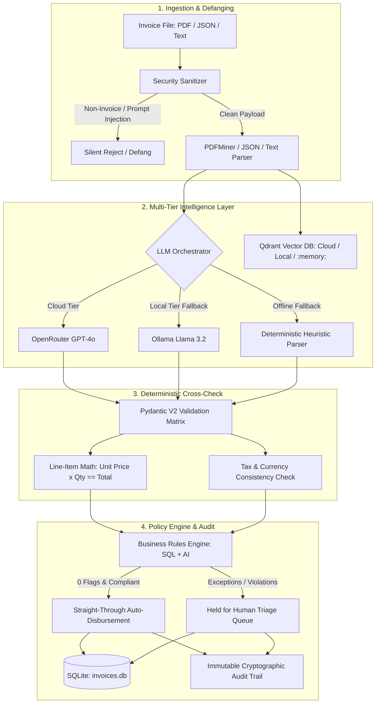

# FlowAudit AI — Autonomous Invoice Pipeline & Policy Engine

FlowAudit AI is an enterprise-grade, high-throughput invoice ingestion, validation, and policy enforcement system. It pairs zero-shot structured LLM extraction with deterministic mathematical verification, vector field matching via Qdrant, a dual-engine business rules system, and an anti-poisoning security layer.

---

## Architecture Overview



---

## Core Capabilities

- **Resilient Multi-Tier LLM Routing**: Primary cloud reasoning via OpenRouter (`gpt-4o` / `gpt-4o-mini`), automatic local failover to Ollama (`llama3.2`), and 100% offline fallback to zero-dependency deterministic parsers.
- **Adaptive Vector Field Matching (Qdrant)**: Schema mapping backed by Qdrant with seamless three-tier resolution: Qdrant Cloud Cluster $\rightarrow$ Local Qdrant Server $\rightarrow$ embedded in-memory (`:memory:`) storage.
- **Strict Mathematical Verification**: Deterministic verification cross-checking unit prices, quantities, item totals, subtotal additions, and tax calculations before accepting any LLM inferences.
- **Dual Policy Engine**:
  - **Deterministic SQL Evaluator**: Instantaneous, zero-token cost rule enforcement (e.g., threshold limits, vendor currency checks).
  - **Cognitive AI Auditor**: Contextual policy enforcement (e.g., suspicious terms, out-of-scope services, compliance validation).
  - **Live Dry-Run Testing**: Test draft rules against live invoice portfolios before activation.
- **Security Defanging & Context Defense**: Heuristic and semantic scanners intercept prompt injection attempts, context poisoning payloads, and non-invoice file uploads.
- **Audit Ledger**: Timestamped, immutable ledger recording every validation step, rule trigger, and human intervention with cryptographic hashing.

---

## Repository Structure

```text
├── src/
│   └── invoice_pipeline/
│       ├── extraction/       # LLM zero-shot extraction & schema normalization
│       ├── ingestion/        # Multi-format parsers (PDF, JSON, text)
│       ├── payment/          # Automated disbursement scheduling
│       ├── review/           # Triage state management & cognitive reflection loop
│       ├── security/         # Anti-poisoning filters & non-invoice detection
│       ├── storage/          # SQLite persistence & Qdrant vector client
│       ├── validation/       # Deterministic math & currency cross-checks
│       ├── llm_client.py     # Multi-tier resilient LLM client (OpenRouter/Ollama/Offline)
│       ├── models.py         # Pydantic v2 domain schemas & flag definitions
│       ├── pipeline.py       # Central pipeline orchestrator
│       └── server.py         # FastAPI REST API application
├── tests/                    # Comprehensive Pytest test suite (88 passing tests)
├── invoices/                 # Sample invoices for testing & triage
├── main.py                   # Unified CLI & API server entry point
├── config.yaml               # Pipeline configurations & thresholds
├── pyproject.toml            # Package metadata & Python dependencies
└── .env.example              # Environment variables template
```

---

## Prerequisites

- **Python**: 3.11 or higher
- **Package Manager**: `pip` (or `uv` / `poetry`)
- **Optional Local LLM**: [Ollama](https://ollama.com/) with `llama3.2` installed (`ollama pull llama3.2`)
- **Optional Vector DB**: [Qdrant](https://qdrant.tech/) running on port 6333 or Qdrant Cloud

---

## Quickstart & Installation

### 1. Clone & Set Up Virtual Environment

```bash
git clone <repository-url>
cd invoice-problem

python -m venv venv
# Windows:
.\venv\Scripts\activate
# Linux/macOS:
source venv/bin/activate
```

### 2. Install Dependencies

```bash
pip install -e ".[dev]"
```

### 3. Configure Environment Variables

Copy `.env.example` to `.env`:

```bash
cp .env.example .env
```

Edit `.env` to configure your keys:

```ini
# LLM Routing Mode: auto, openrouter, ollama, openai, gemini
LLM_PROVIDER=auto
OPENROUTER_API_KEY=your_openrouter_api_key_here

# Local Ollama Fallback
OLLAMA_BASE_URL=http://localhost:11434/v1
OLLAMA_MODEL=llama3.2

# Qdrant Vector Storage Mode: auto, cloud, local, memory
QDRANT_MODE=auto
QDRANT_URL=https://your-cluster-id.region.qdrant.io
QDRANT_API_KEY=your_qdrant_api_key_here
```

---

## Running the FastAPI Server

Start the backend service powering the dashboard:

```bash
python main.py serve --port 8000 --reload
```

- **API Root**: `http://localhost:8000`
- **Interactive OpenAPI Documentation**: `http://localhost:8000/docs`
- **Alternative ReDoc Documentation**: `http://localhost:8000/redoc`

---

## Command Line Interface (CLI)

The backend includes a feature-rich CLI via Click:

### Ingest Invoices
```bash
# Ingest a single invoice file
python main.py ingest invoices/facture_1200.json

# Batch ingest an entire directory
python main.py ingest invoices/
```

### Inspect Invoices
```bash
# List all ingested invoices with status, total, and flag counts
python main.py list

# Display detailed breakdown of a specific invoice
python main.py show INV-1004
```

### Policy Rules Management
```bash
# List all configured vendor policy rules
python main.py rules list

# Add a deterministic threshold rule
python main.py rules add --name "Block High Value" --type amount_threshold --value 50000 --action reject
```

---

## Testing & Quality Assurance

Run the comprehensive test suite:

```bash
pytest -v
```

The test suite validates:
- Multi-tier LLM failover behavior (online, offline, mock).
- Deterministic arithmetic verification and tax recalculation.
- Prompt injection defense and non-invoice rejection.
- SQLite persistence, revision histories, and audit ledger integrity.
- Business rule triggers (deterministic SQL and cognitive models).

---

## API Endpoints Reference

| Method | Endpoint | Description |
| :--- | :--- | :--- |
| `GET` | `/api/invoices` | List all processed invoices with filtering, search, and flags |
| `GET` | `/api/invoices/{id}` | Retrieve complete invoice detail, line items, and audit timeline |
| `POST` | `/api/invoices/upload` | Upload and ingest a new invoice file (PDF/JSON/Text) |
| `POST` | `/api/invoices/{id}/approve` | Approve a withheld invoice for disbursement |
| `POST` | `/api/invoices/{id}/reject` | Block and reject a withheld invoice |
| `POST` | `/api/invoices/{id}/blacklist` | Blacklist vendor and reject related invoices |
| `GET` | `/api/rules` | List all active deterministic and cognitive business rules |
| `POST` | `/api/rules` | Create a new vendor policy rule |
| `POST` | `/api/rules/{id}/toggle` | Toggle rule enforcement status (`ACTIVE` vs `PAUSED`) |
| `POST` | `/api/rules/test` | Dry-run a policy rule against live portfolio invoices |
| `GET` | `/api/audit-logs` | Retrieve immutable audit timeline stream |
| `GET` | `/api/settings` | Retrieve active system infrastructure telemetry & settings |
