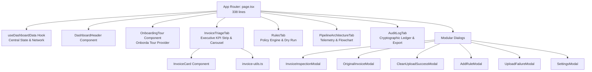

# FlowAudit AI Dashboard — Executive Invoice Triage & Policy Console

A Next.js executive cockpit for invoice triage, automated policy enforcement, and live audit ledger inspection. Engineered with clean modular component architecture, Tailwind CSS v4, dynamic sliding animations, and the Onborda interactive product tour.

---

## Architectural Layout



---

## Key Features

### 1. Executive Triage Deck & Sliding Carousel
- **Hardware-Accelerated Sliding Scope Switcher**: A segmented control toggle between **Pending Triage** and **All Portfolio** driven by a smooth white sliding pill with `cubic-bezier(0.16, 1, 0.3, 1)` easing.
- **Horizontal Slide-In Animations**: Cards glide smoothly into place when switching scopes (`animate-slide-in-right` on All Portfolio, `animate-slide-in-left` on Pending Triage).
- **Viewport Scroll Stability (Zero Page Jump)**: Carousel navigation scrolls only the horizontal track container without moving or jumping the browser page/window vertically.
- **Keyboard Shortcuts**: Navigate invoices with `←` / `→` arrow keys, instantly approve with `A`, reject with `R`, and dismiss modals with `Escape`.

### 2. Policy Engine & Rule Simulator
- **Live Dry-Run Testing**: Test draft or existing vendor business rules against current invoice batches before activation.
- **Dual Policy Support**: Visual distinction between 0ms deterministic SQL rules and cognitive AI governance rules.
- **Rule Management**: Real-time rule toggling (`ENFORCING` vs `PAUSED`), deletion, and creation modal with rule archetypes.

### 3. Cryptographic Audit Ledger
- **Executive Metrics**: Total processed invoice capital, straight-through rate, withheld under review, and blocked payments.
- **Immutable Timeline**: Filter by exception status, counterparty, or date range.
- **CSV Export**: Instant one-click export of audit logs for corporate reporting.

### 4. Interactive Onboarding Product Tour
- Powered by **Onborda**, guiding first-time users through:
  1. `#onborda-kpis`: Executive KPI metrics strip
  2. `#onborda-upload`: Ingestion & drag-and-drop dropzone
  3. `#onborda-scope-selector`: Scope filter toggle
  4. `#onborda-settings`: Cognitive review & system telemetry
  5. `#onborda-rules-nav`: Policy engine navigation

---

## Directory Structure

```text
frontend/
├── src/
│   ├── app/
│   │   ├── globals.css           # Design tokens, keyframe animations, scrollbars
│   │   ├── layout.tsx            # Font injection (Plus Jakarta Sans, JetBrains Mono)
│   │   └── page.tsx              # Orchestrator wiring components with useDashboardData
│   ├── components/
│   │   ├── audit/
│   │   │   └── AuditLogTab.tsx   # Institutional ledger table & CSV export
│   │   ├── common/
│   │   │   └── Icon.tsx          # Material Symbols icon wrapper
│   │   ├── dashboard/
│   │   │   ├── DashboardHeader.tsx # Top navigation bar, tabs, upload trigger
│   │   │   ├── InvoiceCard.tsx   # Paper-styled invoice card with actions
│   │   │   └── InvoiceTriageTab.tsx# Scope pill, filter bar, card carousel
│   │   ├── modals/
│   │   │   ├── AddRuleModal.tsx  # Create policy rule modal
│   │   │   ├── CleanUploadSuccessModal.tsx # Zero-flag disbursement confirmation
│   │   │   ├── InvoiceInspectionModal.tsx  # 3-way variance inspection modal
│   │   │   ├── OriginalInvoiceModal.tsx    # Raw PDF iframe & JSON viewer
│   │   │   ├── SettingsModal.tsx # Infrastructure telemetry & tour reset
│   │   │   └── UploadFailureModal.tsx      # Quota 429 & parsing error diagnostics
│   │   ├── onboarding/
│   │   │   └── OnboardingTour.tsx# Onborda multi-step tour provider
│   │   ├── pipeline/
│   │   │   └── PipelineArchitectureTab.tsx # Flowchart & execution specs
│   │   └── rules/
│   │       └── RulesTab.tsx      # Vendor rules console & dry-run test
│   ├── hooks/
│   │   └── useDashboardData.ts   # Centralized reactive state hook
│   └── lib/
│       └── invoice-utils.ts      # Pure formatters, flags analysis, badge helpers
├── public/                       # Static branding assets
├── package.json                  # Scripts & dependencies
└── tsconfig.json                 # TypeScript compiler configuration
```

---

## Getting Started

### 1. Prerequisites
- **Node.js**: 18.18 or higher (Node 20+ recommended)
- **Package Manager**: `npm`, `pnpm`, or `yarn`
- **Backend API**: Running on `http://localhost:8000` (see root `README.md`)

### 2. Installation

```bash
cd frontend
npm install
```

### 3. Development Server

Run the development server with Turbopack:

```bash
npm run dev
```

Open [http://localhost:3000](http://localhost:3000) with your browser.

### 4. Production Build & Linting

```bash
# Verify TypeScript and build optimized production bundle
npm run build

# Run ESLint validation
npm run lint

# Start production server
npm run start
```

---

## Design System & Styling Tokens

The application follows institutional financial styling guidelines:
- **Typography**: `Plus Jakarta Sans` for clean, professional executive readability, and `JetBrains Mono` for tabular currency figures and timestamps.
- **Color Palette**: Slate neutrals (`#0f172a`, `#334155`), Indigo primary accents (`#4f46e5`), Emerald for straight-through approvals (`#059669`), Rose for flagged anomalies and policy violations (`#e11d48`).
- **Animations**:
  - `.animate-slide-in-right`: Horizontal entrance from right on All Portfolio scope switch
  - `.animate-slide-in-left`: Horizontal entrance from left on Pending Triage switch
  - `.animate-fade-in`: Tab view transitions
  - `.animate-scale-in`: Popover and modal entrance
